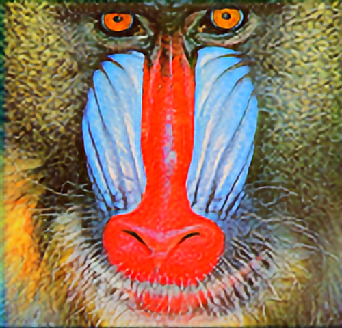
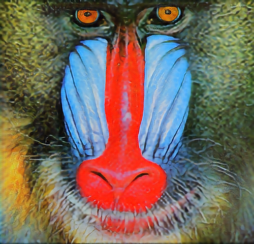
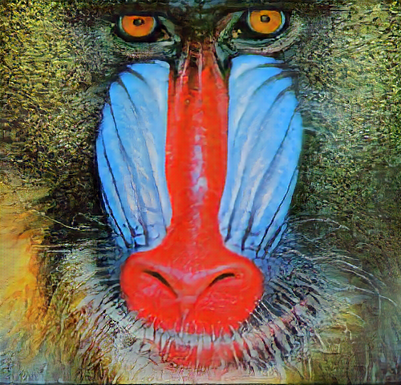
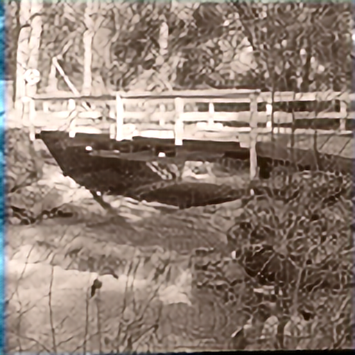
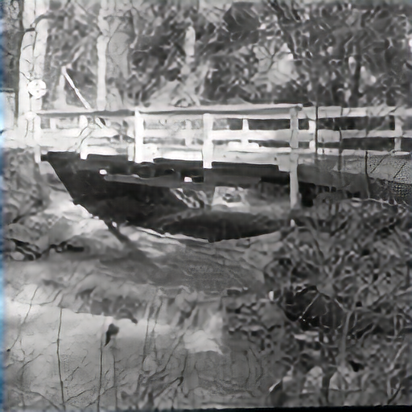
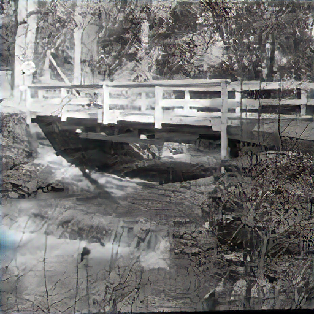
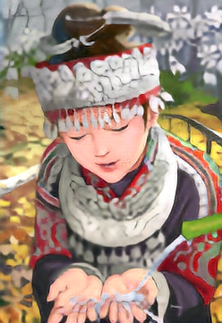
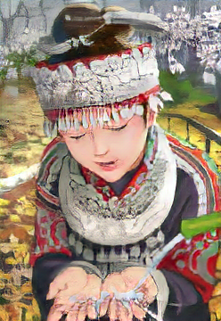

# Single Image Super Resolution in Tensorflow
Tensorflow implementation of SRGAN presented in [1]. The work presented in the paper is extended using Wasserstein GAN
propesed in [5] to stabilize training.

# Results
I have trained the model in this way: 
- 90k iteration for SRResNet (opt: MSE)
- 70k iteration for SRGAN (opt: MSE) 
- 40k iteration for SRGAN (opt: VGG_loss) 

|  Inputx4 (LR, cubic) | SRResNet (90k, MSE) | SRGAN (70k, MSE) | SRGAN (40k, VGG) | Target (HR)|
| ------------- |:----------------:| ----------------:|:----------------:| ----------:|
|       |  |  |  |  |
|       |  |  |  |  |
|       |  |  |  |  |
 
In order to obtain even better results we should train the model way more but still, with that few iteartions 
we are able to achieve good results. Notice that the VGG loss image might sometimes look worst then the one obtained 
via MSE. this is once again due to the small number of iteration, what we can apreciate though is that with VGG loss we 
are starting to obtain much more details w.r.t MSE. Thus, more training for the SRGAN with VGG loss is recommneded in order to obtrain way better results.

## Sub-pixel Convolution
Upscaling is handled in the last layers of the network and not at the beginnning. No interpolation is used so that
the network can learn a LR to HR mapping by itself.
In [4] a L layer convolutional neural network is directly applied to
the LR image, and then a sub-pixel convolution layer
that upscales the LR feature maps to produce the SR image is appllied.

## Losses used 
- **Pixelwise MSE loss** see [1]
- **VGG loss**: as explained in [2] the idea of this loss is to try to match the HR image (y) feature representation
 as computed by a CNN network \phi (like VGG-19 pretrained on ImageNet) instead of matching the image itself (pixelwise MSE loss). 
 Given an internal layer of \phi the feature reconstruction loss is the squared, normalized Euclidean distance between 
 the feature representations:
 L_{vgg} = \frac{1}{W_j H_j C_j} \sum \phi_j(y) - \phi_j(\hat{y}).
 Finding an image \hat{y} that minimizes the feature reconstruction loss for early layers tends to produce images that are 
 visually indistinguishable from y as demostrated in [3].
 This principle is also used for improving GAN training and is sometimes refereed to as feature matching [6].
 
- **Adversarial Loss** see [1]

## Small changes to SRGAN in this implementation

#### One-sided Label Smoothing
From [6]. When feeding the discriminator, instead of providing 1 and 0 labels, 
use soften values (0.9, 0.1). It is shown to reduce the networks’ vulnerability.

#### Virtual Batch Normalization (VBN)
From [6]. TODO

Each data sample is normalized based on a fixed batch (“reference batch”) of data 
rather than within its minibatch. The reference batch is chosen once at 
the beginning and stays the same through the training.

#### Wasserstein GAN (_main_wgan.py_)
TODO (Not working)

Few changes to the original GAN implementation that can be summarized by the 
following points ( _I really recommend to check out [6] as it is really well done. Indeed, most of the statements 
below are taken from there_):  
- Output logit from D (no more sigmoid activation in the final step)
- Remove log loss from D and G
- Clip discriminator weights (see _c_ parameter in main_wgan.py).
- Use RMSProp optimizer
- Train D more then G (see _n_critic_ parameter in main_wgan.py)
- Reduce learning rate (from 1e-4 to 5e-6)

For more information on WGAN see the reference paper [5], a detailed explenation of their difference w.r.t GAN is provided 
in this blog post [6] or if you just want to see a basic Tensorflow implementation of WGAN without many maths details 
you can refer to [7].

### Some more Info 
- If you see a starnge checkboard patterns in the generated image and you are interested in understanding that behaviour have a look at 
 this great blog post [8].
- [https://github.com/brade31919/SRGAN-tensorflow](https://github.com/brade31919/SRGAN-tensorflow) an other implementation of the same paper. I have taken inspiration from this.

## References
[1] [Photo-Realistic Single Image Super-Resolution Using a Generative Adversarial
Network](https://arxiv.org/abs/1609.04802) by Christian Ledig, Lucas Theis, Ferenc Huszár, Jose Caballero, Andrew Cunningham,
Alejandro Acosta, Andrew Aitken, Alykhan Tejani, Johannes Totz, Zehan Wang, Wenzhe Shi.

[2] [Perceptual Losses for Real-Time Style Transfer
and Super-Resolution](https://arxiv.org/abs/1603.08155) by Justin Johnson, Alexandre Alahi, Li Fei-Fei.

[3] [Understanding deep image representations by inverting them](https://arxiv.org/abs/1412.0035) by A. Mahendran, A. Vedaldi.

[4] [Real-Time Single Image and Video Super-Resolution Using an Efficient Sub-Pixel Convolutional Neural Network](https://arxiv.org/abs/1609.05158v2) by Wenzhe Shi, Jose Caballero, Ferenc Huszar, Johannes Totz, Andrew P. Aitken, Rob Bishop, Daniel Rueckert, Zehan Wang

[5] [Wasserstein GAN](https://arxiv.org/abs/1701.07875) by Martin Arjovsky, Soumith Chintala, Léon Bottou.

[6] [From GAN to WGAN](https://lilianweng.github.io/lil-log/2017/08/20/from-GAN-to-WGAN.html)

[7] [Wasserstein GAN implementation in TensorFlow and Pytorch](https://wiseodd.github.io/techblog/2017/02/04/wasserstein-gan/)

[8] [Deconvolution and Checkerboard Artifacts](https://distill.pub/2016/deconv-checkerboard/)
